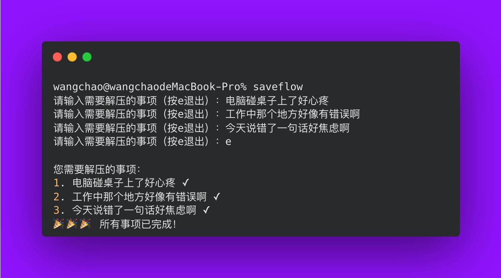

<h1 align="center"> SaveFlow </h1>

<p align="center">An command-line decompression tool</p>

<p align="center">
   <a href="https://www.npmjs.com/package/saveflow"></a>
</p>

<p align="center">
   
<p>

<br>

## Setup

Install _saveflow_:

   ```sh
   npm install -g saveflow
   ```

## Usage

```bash
saveflow
```

## Credit

- Thanks to antfu's open source project [ni](https://github.com/antfu/ni).
- Thanks ChatGPT for helping me.